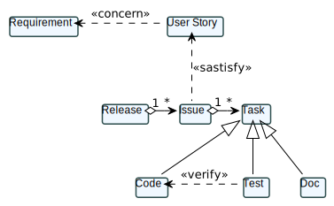
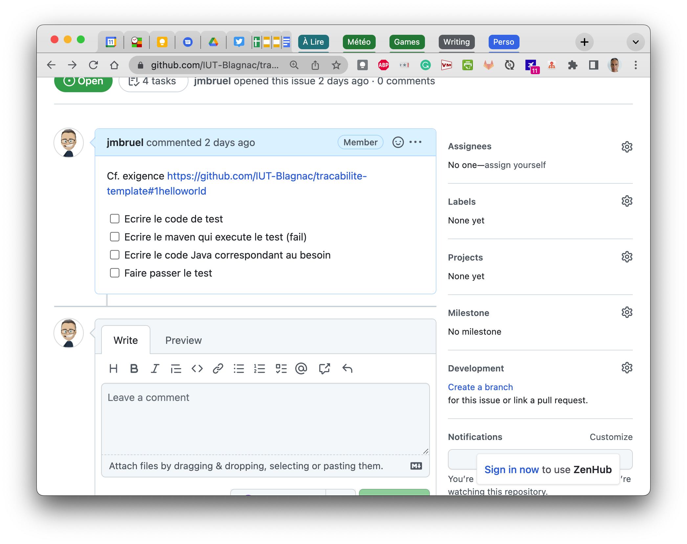
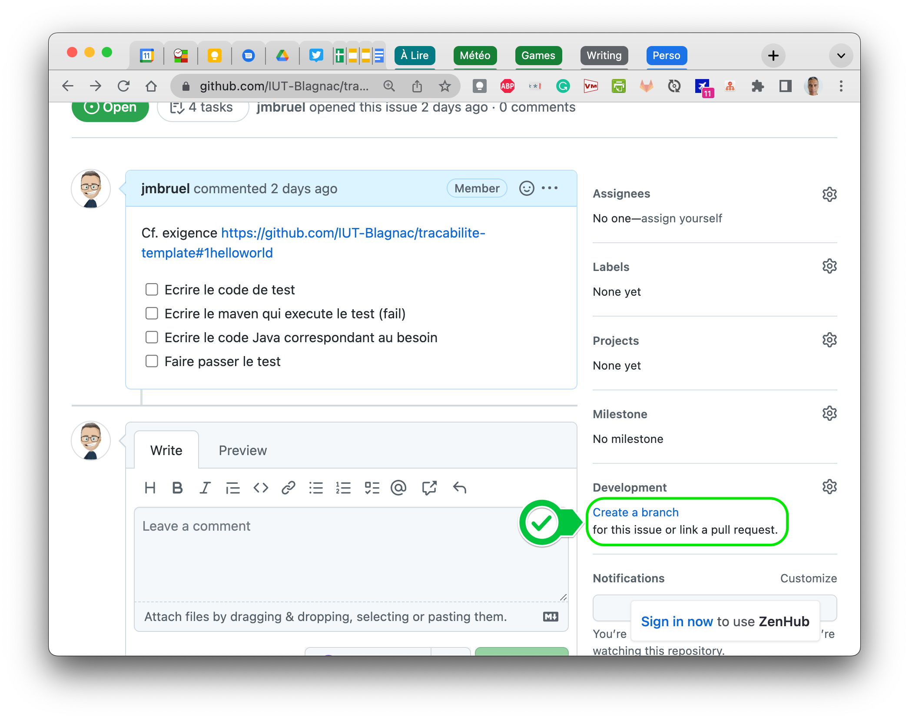
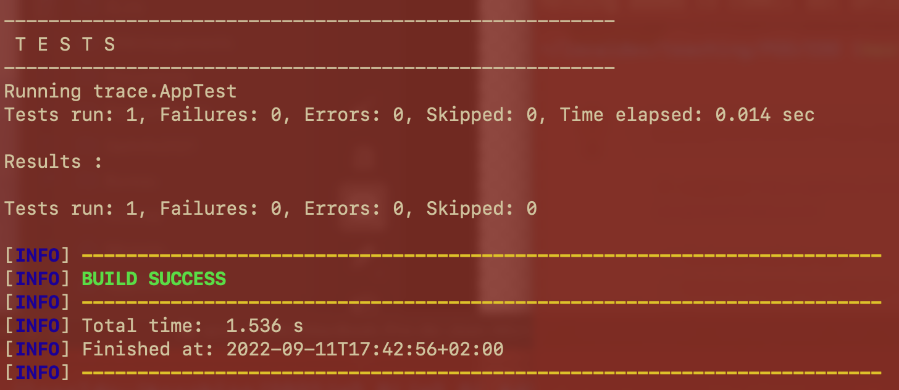
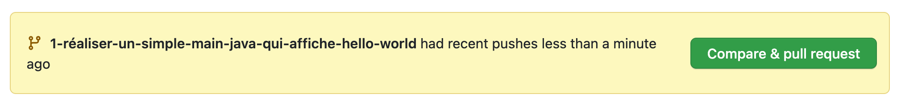
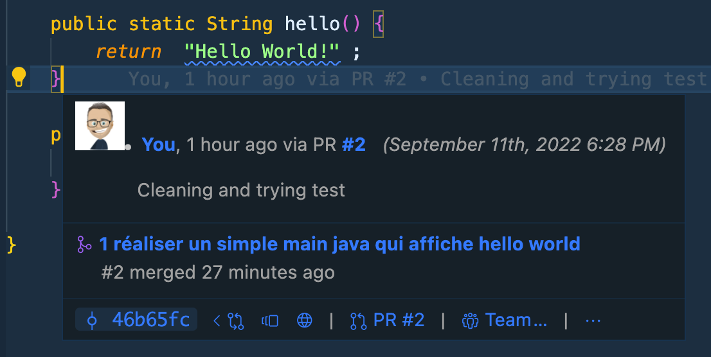
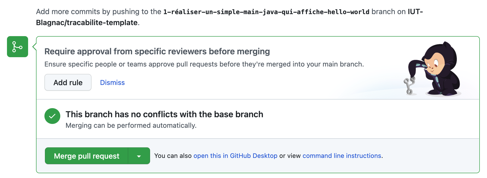
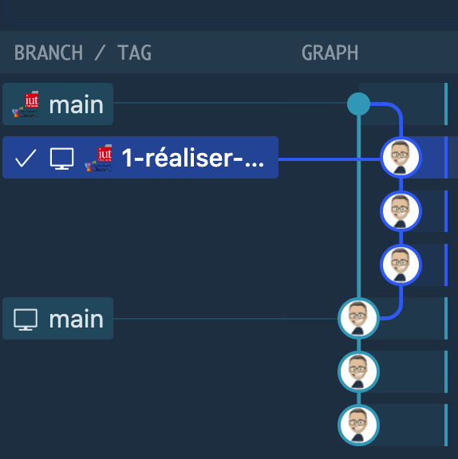

= Traçabilité exigences - code
:icons: font
:MoSCoW: https://fr.wikipedia.org/wiki/M%C3%A9thode_MoSCoW[MoSCoW]

== Contexte

Le but de ce TD/TP est de vous montrer des exemples de traces formelles entre les différents artefacts de votre application (des exigences jusqu'au code).

.Les principaux artefacts qui nous intéressent en  R3-03 (Inspiré de https://github.com/xblanc33/QualiteDev/[ici])

== Exigences

Voici la liste des exigences de départ :

=== 1 -- HelloWorld 

Description::
Le programme doit contenir une méthode `hello()` qui retourne "Hello World!" quand on l'exécute sans paramètre. 

Issue::
- https://github.com/IUT-Blagnac/tracabilite-template/issues/1

Importance::
Must

=== 2 -- Echo 

Description::
La méthode `hello()` doit retourner son paramètre quand on l'invoque avec un paramètre. 

Issue::

Importance::
Should

[TIP]
=====
Nous utilisons ici la méthode {MoSCoW} d'estimation.
=====

== Étapes

. Récupérez un dépôt via classroom  et clonez-le localement :  https://classroom.github.com/a/57HhItOw
. Créez une (ou plusieurs) issue correspondant à des développement, des tests ou  de la doc en lien avec une exigence.
+
.Exemple d'issue

+
. Liez-là à l'exigence (comme c'est fait ci-dessus)
. Créez une branche dédiée
+
.Une branche liée à une issue

+
. Créez un projet `maven` dans votre dépôt, avec  le plugin de votre IDE, ou avec les commandes maven : 
+
[source]
-----
mvn archetype:generate -DinteractiveMode=false
-----
. Réalisez les tests, puis le code, puis la javadoc du code dans cette branche
+
.mvn test

+
. Une fois que tout fonctionne, réalisez une merge request (nécessite que le code correct  soit poussé sur le dépôt distant)
+
.Une branche liée à une issue

+
TIP: Notez, avant la dernière étape, comme vous pouvez "naviguer" de l'exigence au code ou vice-versa.
+
.Bulle info sur l'origine du code

+
. Acceptez la merge request, détruisez la branche et fermez l'issue.
+
.Accepter la merge request

.Trace dans les commits

+
. Répétez l'opération pour une fonctionnalité de votre choix, un peu plus compliquée. Juste pour tester que cette  démarche est acquise.
